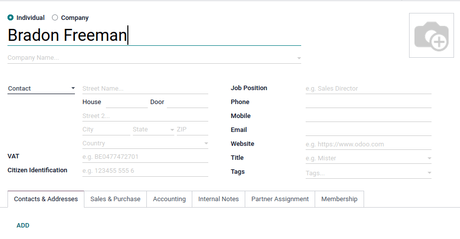

========
Contacts
========

The *Contacts* application comes installed on all Odoo databases. Contacts are created for customers
that the company does business with through Odoo. A contact is a repository of vital business
information, facilitating communication and business transactions.

Contact form
============

To create a new contact, navigate to the *Contacts* app, and click :guilabel:`Create`. A new form
appears where various contact information can be added.

Odoo allows for both :guilabel:`Individual` and :guilabel:`Company` contacts. Select, either,
:guilabel:`Individual` or :guilabel:`Company` depending on the type of contact that is being added.

Name
----

First file in the *name* of the :guilabel:`Individual` or :guilabel:`Company`. This is how the name
will appear throughout the database. This *name*  field is manditory.

.. tip::
   :guilabel:`Individual` contacts can have a :guilabel:`Company` contact linked to it. After
   selecting :guilabel:`Individual` a new field, called :guilabel:`Company` appears below the first
   name field.

Address
-------

Next, enter the :guilabel:`Address` of the :guilabel:`Company` or :guilabel:`Individual`.

.. tip::
   If an :guilabel:`Individual` is chosen, then the *type of address* can be chosen. Option for this
   drop-down menu include: :guilabel:`Contact`, :guilabel:`Invoice Address`, :guilabel:`Delivery
   Address`, :guilabel:`Other Address`, and :guilabel:`Private Address`.

Additional fields
-----------------

Additionally, there are a few more details available on the initial form. The following fields are
available:

- :guilabel:`VAT`: Value Added Tax number.
- :guilabel:`Citizen Identification`: citizen or government identification number (only available
  on :guilabel:`Individual`).
- :guilabel:`Job Position`: list the job position of the :guilabel:`Individual` (only available on
  :guilabel:`Individual`).
- :guilabel:`Phone`: list phone number with country code. Make a call, send an SMS or WhatsApp
  message by hovering over the field on the saved form.
- :guilabel:`Mobile`: list mobile phone number with country code. Make a call, send an SMS or
  WhatsApp message by hovering over the field on the saved form.
- :guilabel:`Email`: enter the email address with the domain.
- :guilabel:`Website`: enter the full website address with the `http` or `https` part.
- :guilabel:`Title`: enter :guilabel:`Doctor`, :guilabel:`Madam`, :guilabel:`Miss`,
  :guilabel:`Mister`, :guilabel:`Professor`, etc.
- :guilabel:`Tags`: enter preconfigured tags by typing them in the field or clicking the drop-down
  menu and selecting one. To create a new one, type the :guilabel:`Tag` in the field, and click
  :guilabel:`Create`.

Contacts and Addresses tab
--------------------------

There are a few tabs at the bottom of the contact form. Let's start on the :guilabel:`Contacts and
Addresses` tab. Here, contacts can be added that are associated with a :guilabel:`Company` and
related addresses. For example, a specific contact person for the company can be listed here.

Multiple addresses can be added on both :guilabel:`Individual` and :guilabel:`Company` contacts.
Click :guilabel:`Add`, which is located under the :guilabel:`Contacts & Addresses` tab. Doing so
reveals a :guilabel:`Create Contact` pop-up form, in which additional addresses can be configured.

.. image:: contacts/contact-form-add-address.png
   :align: center
   :alt: Add a contact/address to the contact form.

On the :guilabel:`Create Contact` pop-up form, start by clicking the default :guilabel:`Other
Address` field to reveal a drop-down menu of address-related options.

Select any of the following options:

- :guilabel:`Contact`: adds another contact to the existing contact form.
- :guilabel:`Invoice Address`: adds a specific invoice address to the existing contact form.
- :guilabel:`Delivery Address`: adds a specific delivery address to the existing contact form.
- :guilabel:`Other Address`: adds an alternate address to the existing contact form.
- :guilabel:`Private Address`: adds a private address to the existing contact form.

Once an option is selected, proceed to enter the corresponding contact information that should be
used for the specified address type.

.. image:: contacts/create-contact-window.png
   :align: center
   :alt: Create a new contact/address on a contact form.

Add the :guilabel:`Contact Name`, :guilabel:`Address`, :guilabel:`Email`, and phone numbers below.

Set :guilabel:`Job Position`, which will appear, should the :guilabel:`Contact` address type have
been selected. This is similar to the :guilabel:`Individual` contact.

There is also an :guilabel:`Note` field down here, as well. To make one, click on the text field
next to :guilabel:`Notes`, and write anything that is applicable to the customer or contact.

Then, click :guilabel:`Save & Close` to save the address and close the :guilabel:`Create Contact`
window. Or, click :guilabel:`Save & New` to save the address and immediately input another one.

Sales & Purchases tab
---------------------

Next, is the :guilabel:`Sales & Purchases` tab, which only appears when the *Sales*, *Purchase*,
**or** *Point of Sale* applications are installed.

Here, a specific :guilabel:`Salesperson` can be assigned to a contact. To do that, click the
:guilabel:`Salesperson` drop-down field, and select one. Create a new :guilabel:`Salesperson` by
typing the user's name in and making the appropriate selection.

Certain :guilabel:`Payment Terms` or a certain :guilabel:`Pricelist` can also be set, if needed.
Click the drop-down next to :guilabel:`Payment Terms`, and change it to one of the preselected
:guilabel:`Payment Terms` or :guilabel:`Create` a new one. Select the :guilabel:`Pricelist`
drop-down to choose the appropriate :guilabel:`Pricelist`.

A preferred :guilabel:`Delivery Method`, or a :guilabel:`Barcode` can also be set on the contact.

Next, there are some miscellaneous fields that can be configured on this form, such as
:guilabel:`Company ID`, :guilabel:`Reference`, and even :guilabel:`Industry`.

Lastly. if the company purchases products from this contact, one of the database users can be
designated as the :guilabel:`Buyer`. Specify :guilabel:`Payment Terms`, :guilabel:`Tax Information`,
and a preferred :guilabel:`Payment Method` here. A :guilabel:`Receipt Reminder` can even be set
here. Below that, the :guilabel:`Fiscal Position` can be set.

Accounting tab
--------------

The :guilabel:`Accounting` tab, appears when the *Accounting* application is installed. Here, a user
can add any related :guilabel:`Bank Accounts`, or set default :guilabel:`Accounting entries`.
There’s even a field to format electronic invoicing for this contact.

Internal Notes tab
------------------

Following the :guilabel:`Accounting` tab is the :guilabel:`Internal Notes` tab, where notes can be
left on this contact form, just like on the contact form noted above.

Partner Assignment tab
----------------------

Next is the :guilabel:`Partner Assignment` tab, which by default, includes a geo-location and other
partner options; including :guilabel:`Partner Activation` and :guilabel:`Partner Review`
configurations. These are **only** present when the *Enterprise Resellers* module is installed.

Membership tab
--------------

Finally, is the :guilabel:`Membership` tab, which can help to manage any memberships that are being
offered to this specific contact. It should be noted that this tab is associated with the *Members*
app.

Smart buttons
=============

Towards the top of the :guilabel:`Contact` form there are some other options that are called *smart
buttons* in Odoo.

Here, Odoo displays records related to this contact that were created on other apps. Odoo integrates
information from every single app, so there are many smart buttons.

.. example::
   For example, there is the :guilabel:`Opportunities` smart button, where all the opportunities
   related to this customer will appear from the *CRM* app.

.. tip::
   If the corresponding applications are installed, their related smart buttons will appear
   automatically.

A user can see any :guilabel:`Meetings`, :guilabel:`Sales`, :guilabel:`POS Orders`,
:guilabel:`Subscriptions`, project :guilabel:`Tasks`, and :guilabel:`More`. A user can even quickly
access :guilabel:`Purchases`, :guilabel:`Helpdesk` tasks, :guilabel:`On-time Rate` for deliveries,
:guilabel:`Invoiced` information, :guilabel:`Vendor Bills`, and the :guilabel:`Partner Ledger`
connected to this contact.

Deliveries, documents, loyalty cards, and direct debits will *also* link to smart buttons, like
this, should there be any outstanding/on-file for this contact.

There is also a :guilabel:`Go to Website` smart button. If the contact is a partner, the user will
be able to visit their partner page on the Odoo-built website.

Archive contacts
----------------

Now, if a user decides that they no longer want to have this contact active, the record can simply
be archived. To do that, go to the :icon:`fa-cog` :guilabel:`Action` menu in the top-left, and click
:guilabel:`Archive`.

Then, click :guilabel:`Archive` again from the resulting :guilabel:`Confirmation` pop-up window.

With this contact now successfully archived, as indicated by a banner at the top, they will not show
up in the main contacts page, but they can still be searched for with the :guilabel:`Archived`
filter.

.. tip::
   A contact can be unarchived if the user decides to work with them again. To do that, just click
   the :icon:`fa-cog` :guilabel:`Action` menu again, and click :guilabel:`Unarchive`. As soon as
   this is done, the :guilabel:`Archived` banner is removed, and the contact is back to normal.

.. seealso::
   Contact forms can be accessed in the *Sales* application, as well. Go to :menuselection:`Sales
   app --> Orders --> Customers`, and clear any default filters from the search bar. Then, click on
   the desired customer to open their contact form.

   - :doc:`Add different addresses in CRM <../sales/sales/send_quotations/different_addresses>`
   - `Odoo's eLearning Contacts tutorial
     <https://www.odoo.com/slides/slide/contacts-2527?fullscreen=1>`_

:icon:`fa-hand-spock-o`
